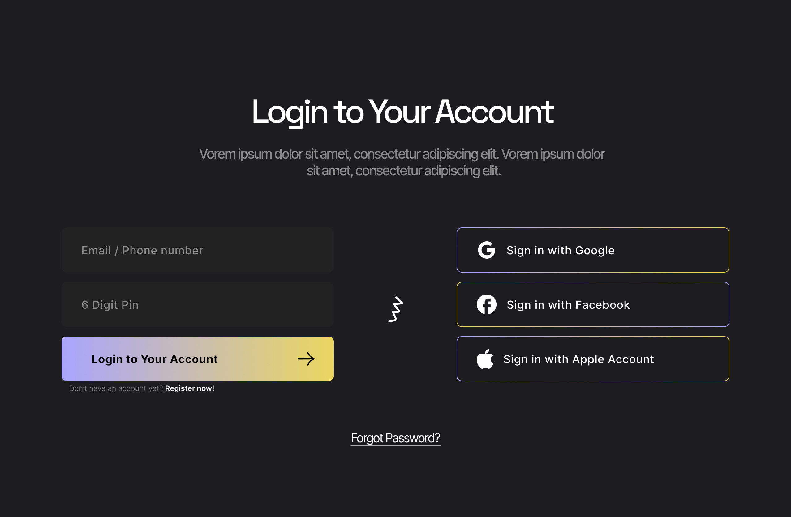
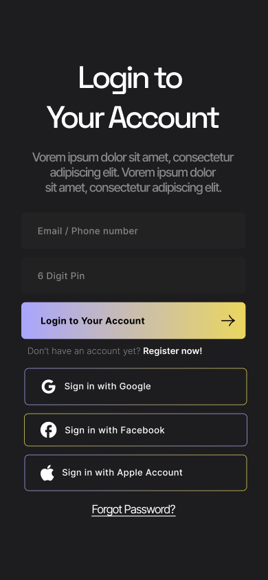

# **🚀 Diseño de Login**
 

 

 

## **Diseño de Figma**
Puedes encontrar el diseño completo de este proyecto en [Figma](https://www.figma.com/file/NeLPW3AY31zU9DSumPe5kS/login-page-(Community)?type=design&node-id=112%3A192&mode=design&t=ScA3SMktsdFtUDo4-1)
